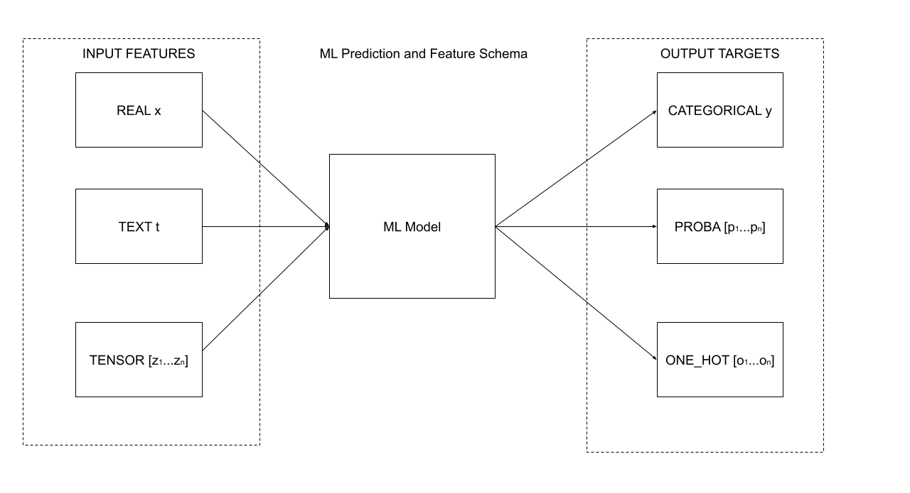

# ML Prediction Schema

### Introduction

The main objective of this research is to propose a generic schema structure for machine learning model predictions. The inputs to any machine learning model are a set of feature values and outputs are a similar set of targets. These features/outputs can be scalars or multi-dimensional vectors or a combination of these as per the machine learning application. The schema proposed in this document is a definition of feature inputs and output targets from the model prediction.

**Note:** For simplicity, this document refers both input and outputs values of the model as features.

## What are the main feature types?

This schema supports six major feature types that covers most machine learning applications. These feature types are listed as follows:

| Feature Type | Description                                                                                                                  |
| ------------ | ---------------------------------------------------------------------------------------------------------------------------- |
| REAL         | Real feature type refers to a numerical scalar input or a prediction output in cases of regression model                     |
| CATEGORICAL  | Categorical feature type refers to an encoded/non-encoded categorical input or a category output from a classification model |
| PROBA        | Proba feature type refers to a probabilistic input or output that has probability values across one or more categories       |
| ONE_HOT      | One hot feature type refers to a input or output that has one hot encoding across one or more categories                     |
| TEXT         | Text feature type refers to a string type input or output feature                                                            |
| TENSOR       | Tensors are a single or multidimensional feature inputs or outputs with a fixed tensor shape                                 |




---

## Feature types and associated schema examples

### REAL

The `REAL` feature type can be any numerical value. Along with the feature name, it is important to provide the associated datatype value to infer the precision of the numerical scalar value. In the following example, Age is a `REAL` feature for a model and the schema structure in JSON format would be as follows,

```json
{
  "name": "Age",
  "type": "REAL",
  "data_type": "FLOAT"
}
```

---

### CATEGORICAL

The `CATEGORICAL` feature type refers to a categorical input or output. This feature value is one of a category set at any given time. In most practical applications, such features are encoded into numeric formats and hence it is important to provide the associated datatype value to infer the precision of the numerical encoding. Further, this feature type also needs the category set size and mapping for the encoding. An example categorical feature in JSON format would be as be shown below.

```json
{
  "name": "Education",
  "type": "CATEGORICAL",
  "data_type": "INT",
  "n_categories": 7,
  "category_map": {
    "0": "Associates",
    "1": "Bachelors",
    "2": "Doctorate",
    "3": "Dropout",
    "4": "High School grad",
    "5": "Masters",
    "6": "Prof-School"
  }
}
```

---

### PROBA

The `PROBA` feature type is a probabilistic model feature or output. Such a feature defines a set of probability values across one or more categories. This feature type is a set of numeric probabilities and needs to define the classes or categories across which these probabilities are divided amongst. An example probabilistic feature schema in JSON format would be as be shown below.

```json
{
  "name": "Income",
  "type": "PROBA",
  "data_type": "FLOAT",
  "schema": [
    {
      "name": "<=$50K"
    },
    {
      "name": ">$50K"
    }
  ]
}
```

---

### ONE_HOT

The `ONE_HOT` feature type is a value set that has one hot encoding across one or more categories. This feature type is a set of numeric one hot values and needs to define the classes or categories across which these values are divided amongst. An example one_hot feature schema in JSON format would be as be shown below.

```json
{
  "name": "Gender",
  "type": "ONE_HOT",
  "data_type": "INT",
  "schema": [
    {
      "name": "Male"
    },
    {
      "name": "Female"
    }
  ]
}
```

---

### TEXT

The `TEXT` feature type is a string type feature value. So an example text feature in JSON format would be as follows,

```json
{
  "name": "Movie Review Comment",
  "type": "TEXT"
}
```

---

### TENSOR

The `TENSOR` feature type are N-dimensional feature inputs or outputs. For this feature type, it is important to provide the associated datatype and shape value to infer the precision and structure of the data. This is a good example for any high dimensional input/output of the model like Image/Audio data. So an example numeric feature in JSON format would be shown below.

```json
{
  "name": "Dashboard Camera Image",
  "type": "TENSOR",
  "data_type": "FLOAT",
  "shape": [32, 32, 3]
}
```

---

Find more examples of the full prediction schema in the [examples folder](./examples). We have also defined a generic [protobuf definition](./proto/prediction_schema.proto) validate any such prediction schema.

## Can this data be auto-generated?

The extensive feature level schema structure proposed in this document can only be auto generated for certain feature types like `REAL` and `TENSOR` types. But for other feature types like `CATEGORICAL`, `PROBA` and `ONE_HOT` this feature level schema can only be generated at the training stage.

This is due to the fact that the created model artifact loses this additional feature level information that represents probabilistic/one-hot feature categories or the encoding and the category map in cases of categorical feature values. Hence this metadata cannot be auto generated from the model artifact post training stage for many important applications.

## Model Monitoring Usecase

The proposed prediction schema as a model level metadata can have a multitude of usecases in the MLOps lifecycle. One of the most important application of such a model level metadata is the post deployment monitoring aspect where the model prediction logs are scanned to watch prediction data in production.

The essence of model monitoring is continously watching the prediction data distributions in production at every feature/target level. Hence, it is vital to understand the schematics of model prediction payload from a feature perspective to create appropriate monitoring visualizations and workflows. Utilizing the proposed schema definition will help standardization across model prediction, logging and other external monitoring systems.

The following image demostrates the metadata required for such usecase in an example model prediction.


The additional metadata that cannot be auto-generated from the model artifact as mentioned above is absolutely imperative for many monitoring applications like plotting distributions of model features from live prediction data. Here, the difference between a `REAL` feature value and `PROBA` category value is not apparent from just the prediction payload and the prediction schema proposed in this document solves that complexity.

## What this document is not proposing?

This document is not an attempt to define an implementation payload schema structure like a Tensorflow Serving Protocol or KFserving V2 Protocol. This prediction schema can be created at model training stage and associated with the model artifact. This is completely separate from the runtime implementation. For example, a tensorflow model with this metadata schema can be implemented with TFServing or a NVIDIA Triton Server and both have different request-response payloads.

The inference payload can be associated with each of these features by the feature name in V2 protocol or jsonpath string in any custom implementation and this is definition is only a model level metadata for any implementation that can be created based on this schema structure.

### References

- [KFServing V2 protocol](https://github.com/kubeflow/kfserving/blob/master/docs/predict-api/v2/required_api.md)
- [NVIDIA Triton Server Auto generated model configuration](https://github.com/triton-inference-server/server/blob/master/docs/model_configuration.md#auto-generated-model-configuration)
